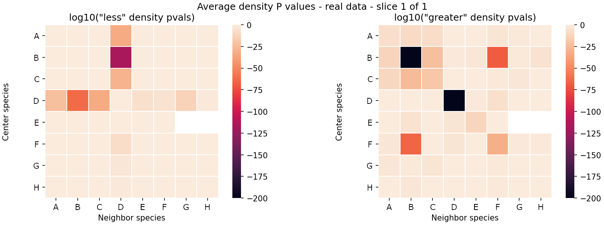

## Project summary

Our experimental collaborators provided data from immunohistochemistry analyses containing the 2D spatial coordinates of immune cells identified by various combinations of protein surface markers. The data were collected from lung cancer patients before and after treatment with an experimental drug and were generated using multiplex immunofluorescence.

The goal was to determine whether cell species were interacting with other species, and to what extent. I translated this question into determining whether the relative densities of cell species around other species were random.

Given that this question equivalent to asking whether the total number of neighbor species around all center species in a region of interest (ROI) is Poisson-distributed, I calculated P values using this Poisson distribution as the null distribution. This utilization of such a parametric method rather than a more-common non-parametric method (such as the permutation test) resulted in more exact results and significantly less computation time.

In particular, I calculated left and right P values, small values of which would indicate that the density of the neighbor cells around the center cells is lower or higher than expected, respectively, where the "expected" number is proportional to the total number of neighbor cells in the ROI. I generated heatmaps containing the logarithm of these P values, with the neighbor species on the x-axis and the center species on the y-axis; for example:

This analysis combined with a measure of a patient's response to the treatment allowed us to identify potential interactions of species of immune cells that might correlate with patient response. This study is on-going.
